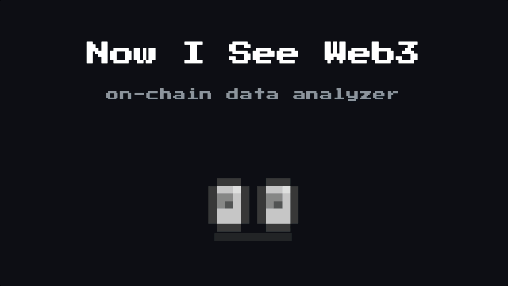

# Now I See Web3 👀


### *Hex. Hashes. Encoded chaos...* </br>*Ever wondered what kind of data is actually living onchain in Web3?*

#### *Now,,, I See Web3 turns unreadable onchain data into something humans can finally inspect, understand, and work with...!*

<br/>
<br/>
<br/>

<p align="center">
  
</p>
<p align="center">
  <b><i>Oh, now I see web3 data...!</i></b>
</p>
<br/>
<br/>


## Features

- **Transaction Analyzer** — Search a tx hash across chains in parallel. Displays tx details, decoded calldata, and event logs.
- **Calldata Decoder** — Paste raw calldata hex and get a human-readable function name, signature, and parameters.
- **Error Decoder** — Paste revert data to decode `Error(string)`, `Panic(uint256)`, or any custom Solidity error.


## Getting Started

```bash
npm install
npm run dev
```

Open [http://localhost:3000](http://localhost:3000).

To build for static deployment:

```bash
npm run build
```

Output is generated in the `out/` directory.
